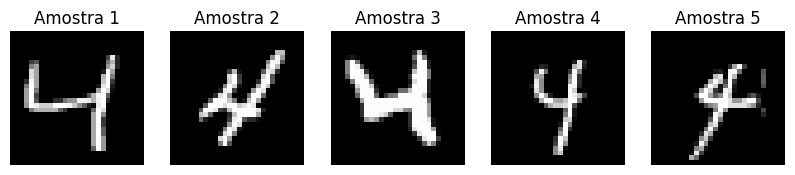

# 🧠 MNIST-GAN: Geração do Dígito "4" com Redes Adversárias

Este projeto implementa uma Rede Adversarial Generativa (GAN) utilizando PyTorch, com o objetivo de gerar imagens manuscritas do dígito **"4"** com base no dataset MNIST.

[](https://colab.research.google.com/github/dede0702/mnist-digit-4-gan/blob/main/MNIST_GAN_Digito4.ipynb)

> *Certifique-se de que o arquivo `MNIST_GAN_Digito4.ipynb` esteja no diretório raiz do repositório para o link do Colab funcionar corretamente.*

---

## 🎯 Objetivo

- Aprender a distribuição dos dados das imagens do dígito "4" do MNIST.
- Gerar novas amostras realistas e diversificadas do dígito "4".
- Demonstrar o processo de treinamento de GANs para uma tarefa de geração específica.

---

## 👨‍💻 Integrantes

- **Andre Rovai** — RM555848  
- **Lancelot Chagas** — RM554707

---

## 📁 Estrutura do Repositório

A estrutura de arquivos do projeto é organizada da seguinte forma:

```bash
mnist-digit-4-gan/
├── models/
│   ├── generator_4.pt          # Pesos do Gerador treinado
│   └── discriminator_4.pt      # Pesos do Discriminador treinado
├── MNIST_GAN_Digito4.ipynb     # Notebook principal com o código e execução
├── images/
│   └── sample_output.png       # Exemplo de imagem gerada (opcional)
└── README.md                   # Este arquivo de descrição do projeto
```


Observação: O dataset MNIST é baixado automaticamente pelo torchvision ao executar o notebook e, por padrão, é salvo em um diretório ./data/. É recomendado adicionar este diretório ao seu arquivo .gitignore se não desejar versioná-lo. Os arquivos .pt na pasta models/ contêm os modelos treinados.

⚙️ Tecnologias Utilizadas
Python 3.x
PyTorch
Torchvision
Matplotlib

🚦 Etapas do Notebook (MNIST_GAN_Digito4.ipynb)
O notebook está organizado nas seguintes seções principais:

1. Instalação de Dependências
Instalação via pip (se local) ou execução de células Colab para torch, torchvision, matplotlib.

2. Importações
Importa as bibliotecas principais e módulos necessários.

3. Dataset: Apenas Dígito "4"
Define e implementa a classe MNIST4Dataset que carrega o dataset MNIST, filtra para incluir somente imagens do número "4", e aplica as transformações necessárias (normalização, etc.). Criação do DataLoader.

4. Modelo: Discriminador
Define a arquitetura da rede neural convolucional (CNN) que atuará como o Discriminador, responsável por classificar as imagens como reais ou falsas.

5. Modelo: Gerador
Define a arquitetura da rede neural (geralmente com camadas de convolução transposta) que atuará como o Gerador, responsável por criar imagens a partir de um vetor de ruído aleatório (z).

6. Inicialização de Parâmetros
Configuração de hiperparâmetros (taxa de aprendizado, tamanho do batch, dimensão latente), inicialização dos modelos Gerador e Discriminador, dos otimizadores (Adam), da função de perda (BCELoss) e definição do dispositivo (CPU/GPU).

7. Treinamento da GAN
Contém o loop principal de treinamento que:
* Itera sobre as épocas e os batches de dados.
* Realiza o treinamento do Discriminador (com amostras reais e falsas).
* Realiza o treinamento do Gerador (tentando enganar o Discriminador).
* Imprime as perdas (loss_D, loss_G) para acompanhamento.
* Gera e exibe amostras de imagens falsas em intervalos regulares (e.g., a cada 10 épocas) para visualização do progresso.

8. Salvamento dos Modelos
Após o treinamento, salva os estados (state_dict) dos modelos Gerador e Discriminador treinados em arquivos .pt no diretório models/.

▶️ Como Executar:

✅ Via Google Colab (Recomendado)
Clique no botão "Abrir no Colab" no início deste README.

No Colab, para um treinamento mais rápido, vá em Ambiente de execução → Alterar tipo de ambiente de execução e selecione GPU como acelerador de hardware.
Execute todas as células do notebook em sequência.

💻 Localmente
Clone o repositório:
git clone https://github.com/dede0702/mnist-digit-4-gan.git
cd mnist-digit-4-gan

Instale as dependências (recomenda-se o uso de um ambiente virtual, ex: venv ou conda):
pip install torch torchvision matplotlib

Execute o notebook:
Abra e execute o notebook MNIST_GAN_Digito4.ipynb utilizando Jupyter Notebook, JupyterLab, VS Code ou sua IDE preferida.

📊 Resultados Esperados
Saída no console/notebook mostrando as perdas do Discriminador (Loss_D) e do Gerador (Loss_G) por época de treinamento.
Visualizações periódicas (ex: grades de 4x4 imagens) das amostras geradas pelo modelo, demonstrando a evolução da qualidade.
Ao final, os modelos treinados (generator_4.pt e discriminator_4.pt) estarão salvos no diretório models/.

Exemplo de Saída Visual:
Se você adicionar um arquivo sample_output.png no diretório images/, ele aparecerá aqui:
<p align="center">

</p>
*(Substitua ou adicione sua própria imagem de exemplo gerada aqui.)*

🔧 Melhorias Futuras e Próximos Passos
Ajuste Fino de Hiperparâmetros: Experimentar diferentes valores para taxa de aprendizado, tamanho do batch, dimensão do espaço latente, ou mesmo arquiteturas para os modelos Gerador e Discriminador.
Técnicas de Estabilização de Treinamento: Investigar e implementar técnicas como "label smoothing", uso de diferentes funções de perda (ex: Wasserstein GAN - WGAN), ou normalização espectral.
Avaliação Quantitativa: Implementar métricas de avaliação de GANs, como Fréchet Inception Distance (FID) ou Inception Score (IS), para uma análise mais objetiva da qualidade e diversidade das imagens geradas.
Geração Condicional: Modificar a GAN para ser condicional, permitindo, por exemplo, gerar outros dígitos específicos sob comando.

📝 Licença
Este projeto é desenvolvido para fins acadêmicos e educacionais e está disponível como código aberto. Sinta-se à vontade para utilizá-lo e modificá-lo.

📬 Contato
Para dúvidas, sugestões ou colaborações, entre em contato através dos perfis do GitHub dos integrantes do projeto.
**Observação Importante sobre o Código no Notebook:**

Para que os modelos sejam salvos e carregados corretamente na pasta `models/` conforme a estrutura do repositório, você precisará ajustar ligeiramente o código de salvamento e carregamento no seu notebook `MNIST_GAN_Digito4.ipynb`:

**Para salvar os modelos:**

```python
import os

# ... (definição do gerador e discriminador) ...
# ... (treinamento) ...

# Criar o diretório models/ se ele não existir
output_dir = "models"
os.makedirs(output_dir, exist_ok=True)

torch.save(generator.state_dict(), os.path.join(output_dir, "generator_4.pt"))
torch.save(discriminator.state_dict(), os.path.join(output_dir, "discriminator_4.pt"))
print(f"Modelos salvos em {output_dir}/")
Use code with caution.
Para carregar os modelos (exemplo):
# latent_dim = 100 # Mesmo latent_dim usado no treinamento
# device = torch.device("cuda" if torch.cuda.is_available() else "cpu")

# generator = Generator(latent_dim) # Recriar a arquitetura
# generator.load_state_dict(torch.load("models/generator_4.pt", map_location=device))
# generator.to(device)
# generator.eval() # Modo de avaliação

# discriminator = Discriminator() # Recriar a arquitetura
# discriminator.load_state_dict(torch.load("models/discriminator_4.pt", map_location=device))
# discriminator.to(device)
# discriminator.eval() # Modo de avaliação
